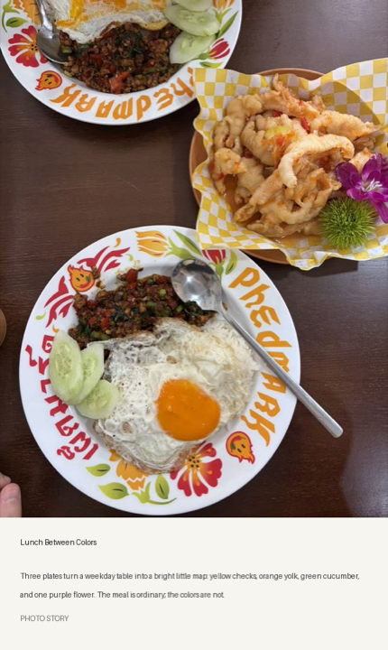

# Awesome AI Visual Skills

[English](README_EN.md) · **简体中文**

精选实用的 AI 制图 Agent Skills，重点关注“输入一张现有照片，按明确的视觉方法重新编排、拼贴、抽象化或转译成完整作品”的工作流。

本项目只做导航、独立简介和安装指引，不镜像第三方 Skill 源码。收录来源不限于 GitHub，也包括公开的 Skill 市场、独立网站、文档站和社区项目。

> 当前只区分“照片再创作”和“通用视觉工作流”，暂不建立复杂标签。顺序不代表排名；信息最后核对于 2026-09-10。

## 照片再创作型 Skill

点击 Skill 名称可进入英文详情页，查看源码、安装方式、调用示例、隐私提示和许可信息。预览图来自各项目公开展示素材；独立原图与结果图标记为 **Before / After**，已经合成的官方案例保持原样展示。

<table>
  <thead><tr><th width="20%">Skill / 作者</th><th width="43%">它能做什么</th><th width="37%">效果预览</th></tr></thead>
  <tbody>
    <tr>
      <td><a href="skills/photo-abstract-editorial.md"><strong>Photo Abstract Editorial</strong></a> by <a href="https://github.com/ZzzLc0405">ZzzLc0405</a></td>
      <td>保留真实照片，并从原图的空间、色彩与构图关系中提炼抽象记忆面板，组成克制的竖向编辑作品。 个人、教育、研究及非商业使用；商业使用需授权。</td>
      <td align="center"> Combined official example</td>
    </tr>
    <tr>
      <td><a href="skills/gathered-scenes-zine.md"><strong>Gathered Scenes Zine</strong></a> by <a href="https://github.com/Zeejay0">Zeejay0</a></td>
      <td>提供两条照片再创作路径：保留真实现场的撕纸拼贴，或只提取语义与情绪、重新创作纸面插画。 个人、非商业使用；商业使用需书面授权。</td>
      <td align="center">  Before · After</td>
    </tr>
    <tr>
      <td><a href="skills/photo-to-zine-postcard.md"><strong>Photo to Zine Postcard</strong></a> by <a href="https://github.com/Whiplashzeb">Whiplashzeb</a></td>
      <td>把照片制作成留白充足的 Zine 明信片，保留原图比例，加入来源于场景的手绘元素、元数据和取色色块。 MIT License。</td>
      <td align="center"> Combined official example</td>
    </tr>
    <tr>
      <td><a href="skills/make-photo-stamp-archive.md"><strong>Make Photo Stamp Archive</strong></a> by <a href="https://github.com/Dlcccc71913">Dlcccc71913</a></td>
      <td>把真实照片与暖白档案纸直接拼接，再根据原图主体设计小型手压图章，适合旅行、建筑和纪念照片。 MIT License。</td>
      <td align="center"> Combined official example</td>
    </tr>
    <tr>
      <td><a href="skills/photo-relic-editorial.md"><strong>Photo Relic Editorial</strong></a> by <a href="https://github.com/wnby">wnby</a></td>
      <td>保留上半部分的摄影事实，把下半部分压缩成具有纸张、版画和东方留白气质的视觉记忆。 MIT License。</td>
      <td align="center"> Combined official example</td>
    </tr>
    <tr>
      <td><a href="skills/8bit-pixel-art.md"><strong>8-bit Pixel Art</strong></a> by <a href="https://github.com/TwentyfiveBTea">TwentyfiveBTea</a></td>
      <td>提取照片中最重要的大形、方向和颜色关系，转译成有主动留白的粗颗粒 8-bit 像素编辑作品，而不是套像素滤镜。 GNU AGPL-3.0。</td>
      <td align="center">  Before · After</td>
    </tr>
    <tr>
      <td><a href="skills/photo-to-monthly-zine-postcard.md"><strong>Photo to Monthly Zine Postcard</strong></a> by <a href="https://github.com/shenchangyi">shenchangyi</a></td>
      <td>制作 3:4 月历感 Zine 明信片：完整保留照片，再加入场景水彩、月份、文学和音乐信息。 MIT License。</td>
      <td align="center"> Combined official example</td>
    </tr>
    <tr>
      <td><a href="skills/gpt-image2-skill.md"><strong>GPT Image 2 Skill</strong></a> by <a href="https://github.com/wuyoscar">wuyoscar</a></td>
      <td>先从参考图提取可复用的正向与负向提示词，再用配套 Skill 生成或编辑图片；同时提供大量风格案例。 MIT License。</td>
      <td align="center">  Before · After</td>
    </tr>
    <tr>
      <td><a href="skills/photo-riso-poster.md"><strong>Photo Riso Poster</strong></a> by <a href="https://github.com/luckdvr">luckdvr</a></td>
      <td>把照片中的主要形状、方向与取样色压缩成 2–3 色孔版印刷海报，保留颗粒、套印偏差和克制文字。 MIT License。</td>
      <td align="center"> Combined official example</td>
    </tr>
    <tr>
      <td><a href="skills/ink-wash-poster.md"><strong>Ink Wash Poster</strong></a> by <a href="https://github.com/TwentyfiveBTea">TwentyfiveBTea</a></td>
      <td>围绕一个主要水墨动作、纸张底色、留白和稀疏排版，把参考照片转译成竖向水墨编辑海报。 GNU AGPL-3.0。</td>
      <td align="center">  Before · After</td>
    </tr>
    <tr>
      <td><a href="skills/xxd-panel-028.md"><strong>XXD Panel 028</strong></a> by <a href="https://github.com/nevertoday">nevertoday</a></td>
      <td>保留照片的主体轮廓、关系和来源色，把场景转成放在纸面底座上的正交等距微缩模型。 PolyForm Noncommercial 1.0.0。</td>
      <td align="center"> Combined official example</td>
    </tr>
    <tr>
      <td><a href="skills/art-split-poster.md"><strong>Art Split Poster</strong></a> by <a href="https://github.com/heycalvin">heycalvin</a></td>
      <td>制作严格 3:4、上下各半的编辑海报：上半保真照片，下半暖白纸面配小型手绘插图与可选文字。 MIT License（父仓库）。</td>
      <td align="center">  Before · After</td>
    </tr>
    <tr>
      <td><a href="skills/heytea-doodle-poster.md"><strong>Heytea Doodle Poster</strong></a> by <a href="https://github.com/Hchen1218">Hchen1218</a></td>
      <td>把食品、饮品或产品照片的主体抠出，与粗黑手绘人物、活泼中文字体和大面积暖白留白重新组合。 代码 MIT；自制示例 CC BY 4.0。</td>
      <td align="center">  Before · After</td>
    </tr>
    <tr>
      <td><a href="skills/photo-polaroid.md"><strong>Photo Polaroid</strong></a> by <a href="https://github.com/LeviQin">LeviQin</a></td>
      <td>用本地确定性脚本把照片放进拍立得卡片，可加标题、日期和旋转角度，不会重新生成主体。 MIT License。</td>
      <td align="center">  Before · After</td>
    </tr>
    <tr>
      <td><a href="skills/photo-postcard.md"><strong>Photo Postcard</strong></a> by <a href="https://github.com/LeviQin">LeviQin</a></td>
      <td>从照片制作可分享的明信片正面，并可生成带留言与地址区域的可打印背面；地点不确定时不会擅自编造。 MIT License。</td>
      <td align="center">  Before · After</td>
    </tr>
    <tr>
      <td><a href="skills/photo-story.md"><strong>Photo Story</strong></a> by <a href="https://github.com/LeviQin">LeviQin</a></td>
      <td>依据画面中可见事实写一段短故事，再把照片与文字排成故事卡；明确区分观察和虚构内容。 MIT License。</td>
      <td align="center">  Before · After</td>
    </tr>
    <tr>
      <td><a href="skills/photo-wallpaper.md"><strong>Photo Wallpaper</strong></a> by <a href="https://github.com/LeviQin">LeviQin</a></td>
      <td>通过模糊补边、居中裁切或纯色适配，将照片制作成指定尺寸的手机或桌面壁纸，不做非等比拉伸。 MIT License。</td>
      <td align="center">  Before · After</td>
    </tr>
  </tbody>
</table>

预览素材的原始链接、作者和许可说明见 [Third-Party Image Credits](THIRD_PARTY_NOTICES.md)。本目录展示不代表原作者为本项目背书。

## 通用制图与视觉工作流

这些 Skill 不一定以“上传照片再设计”为核心，但适合生图、信息图、封面、科学示意图和网站视觉资产等工作。

1. **[imagegen](https://www.skills.sh/openai/skills/imagegen)** — OpenAI  
   通用图像生成与编辑 Skill，覆盖照片、插画、纹理、产品图、UI Mockup 和透明背景素材。[源码](https://github.com/openai/skills/tree/main/skills/.system/imagegen)

2. **[canvas-design](https://www.skills.sh/anthropics/skills/canvas-design)** — Anthropic  
   将视觉理念转化为高完成度 PNG 或 PDF，适合海报、编辑设计与排版型平面作品。[源码](https://github.com/anthropics/skills/tree/main/skills/canvas-design)

3. **[algorithmic-art](https://www.skills.sh/anthropics/skills/algorithmic-art)** — Anthropic  
   使用 p5.js、种子随机数和可调参数创建可复现的算法艺术。[源码](https://github.com/anthropics/skills/tree/main/skills/algorithmic-art)

4. **[ai-image-generation](https://www.skills.sh/genmedia-labs/skills/ai-image-generation)** — GenMedia Labs  
   通过 RunComfy CLI 调用多种模型完成文生图和图生图。[源码](https://github.com/genmedia-labs/skills/tree/main/ai-image-generation)

5. **[flux-best-practices](https://www.skills.sh/black-forest-labs/skills/flux-best-practices)** — Black Forest Labs  
   FLUX 的提示词与工作流指南，覆盖编辑、结构化场景、文字、多参考图与品牌色控制。[来源](https://github.com/black-forest-labs/skills)

6. **[baoyu-cover-image](https://www.skills.sh/jimliu/baoyu-skills/baoyu-cover-image)** — Jim Liu / Baoyu Skills  
   根据文章内容选择画面类型、配色、文字量和情绪，生成中英文封面。[源码](https://github.com/JimLiu/baoyu-skills/tree/main/skills/baoyu-cover-image)

7. **[baoyu-infographic](https://www.skills.sh/jimliu/baoyu-skills/baoyu-infographic)** — Jim Liu / Baoyu Skills  
   将内容结构转成时间线、对比、漏斗、层级和路线图等信息图。[源码](https://github.com/JimLiu/baoyu-skills/tree/main/skills/baoyu-infographic)

8. **[Scientific Schematics](https://agent-skills.md/skills/K-Dense-AI/claude-scientific-skills/scientific-schematics)** — K-Dense AI  
   面向论文、报告与演示文稿的系统图、研究流程、神经网络架构和科学示意图。[源码](https://github.com/K-Dense-AI/scientific-agent-skills/tree/main/skills/scientific-schematics)

9. **[infographic-creator](https://www.skills.sh/antvis/chart-visualization-skills/infographic-creator)** — AntV  
   用结构化语法生成便于调整、文字更准确的信息图。[源码](https://github.com/antvis/chart-visualization-skills/tree/main/skills/infographic-creator)

10. **[imagegen-frontend-web](https://www.skills.sh/leonxlnx/taste-skill/imagegen-frontend-web)** — Taste Skill  
    为网站和 Landing Page 生成配色统一、构图有变化的成套视觉素材。[源码](https://github.com/Leonxlnx/taste-skill/tree/main/skills/imagegen-frontend-web)

## 其他发现渠道

- [Skills.sh](https://www.skills.sh/)
- [Agent-Skills.md](https://agent-skills.md/)
- [SkillsMP](https://skillsmp.com/)
- [Claude Marketplaces](https://claudemarketplaces.com/)
- [Playbooks](https://playbooks.com/skills)

这些目录只用于发现线索；收录前仍应回到原始来源核对作者、更新状态、依赖和许可。

## 收录原则

- 必须有无需登录即可查看的公开介绍或源码页面。
- 优先收录能够直接执行、步骤清楚、有真实案例且仍在维护的项目。
- 不以 Stars 作为唯一标准，实际用途和工作流质量更重要。
- 不收录泄露内容、绕过付费、未经授权转载或来源无法确认的 Skill。
- 示例图只使用许可允许的素材、作者书面授权素材或本项目自制素材，并保留来源。

## 使用前请注意

Agent Skill 可能执行本地命令、读取文件、访问网络，或把照片和提示词发送给第三方服务。安装前请阅读完整的 `SKILL.md` 和脚本，确认权限、API Key、费用、隐私政策与许可证。不要上传无权使用、包含敏感信息或未经当事人同意的照片。

## 贡献

欢迎通过 Issue 或 Pull Request 推荐新的 AI 制图 Skill。请尽量提供名称、作者、公开链接、一句话用途、运行环境、外部依赖、许可证，以及示例图的明确来源和再展示权限。

## 版权与免责声明

本项目是独立社区目录，不代表任何被收录作者、平台或服务商。Skill、项目名称、商标、代码和示例作品的权利归其各自权利人所有；请以原始来源当前的许可证和使用条款为准。

如果你是相关权利人，并认为某个条目或预览存在来源、署名或授权问题，请提交 Issue；确认后将及时更正或移除。
