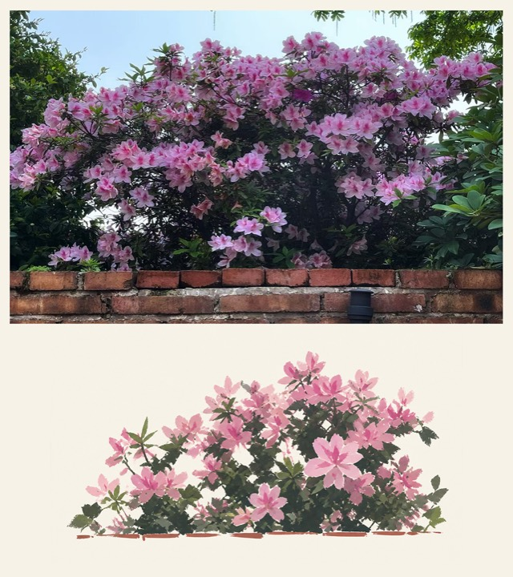
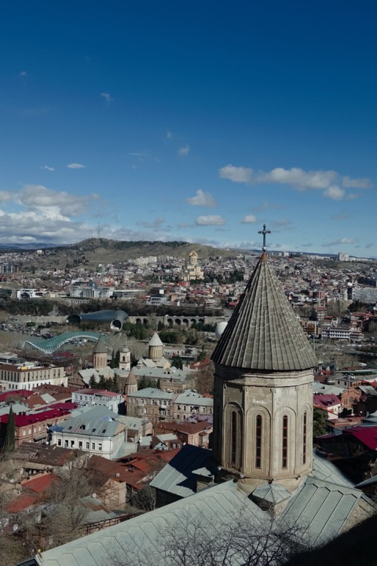
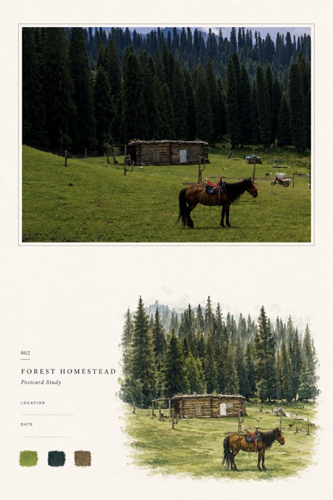
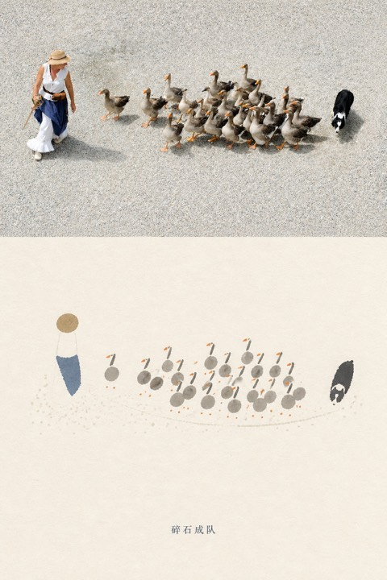
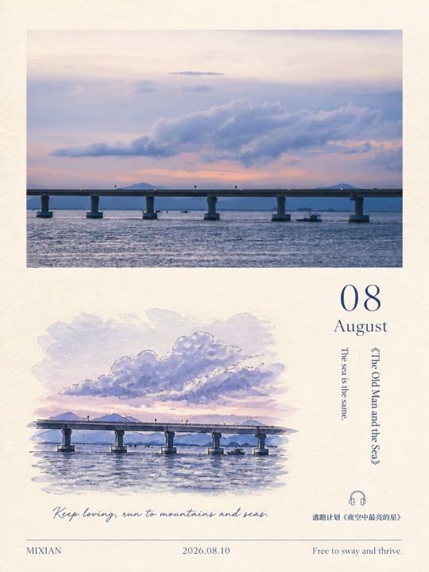

# Awesome AI Visual Skills

**English** · [简体中文](README.md)

A curated directory of practical AI visual Agent Skills, with a particular focus on workflows that take an existing photograph and recompose, collage, abstract, or translate it into a finished visual work.

This repository provides navigation, independently written summaries, and installation notes. It does not mirror third-party Skill source code. Sources may include GitHub, public Skill marketplaces, independent websites, documentation sites, and community projects.

> During this early stage, the directory uses only two broad groups: photo reinterpretation and general visual workflows. Ordering is not a ranking. Information was last checked on 2026-09-09.

## Photo Reinterpretation Skills

Select a Skill name to open its English detail page, including source links, installation, example prompts, privacy notes, and licensing. **Before / After** identifies separately published source and result files. Where a project publishes only a finished composite, the official example remains intact.

<table>
  <thead><tr><th width="20%">Skill / Author</th><th width="43%">What it does</th><th width="37%">Preview</th></tr></thead>
  <tbody>
    <tr>
      <td><a href="skills/photo-abstract-editorial.md"><strong>Photo Abstract Editorial</strong></a> by <a href="https://github.com/ZzzLc0405">ZzzLc0405</a></td>
      <td>Keeps the photograph truthful and derives an abstract memory panel from its spatial, color, and compositional relationships. Personal, educational, research, and non-commercial use; permission required for commercial use.</td>
      <td align="center"> Combined official example</td>
    </tr>
    <tr>
      <td><a href="skills/gathered-scenes-zine.md"><strong>Gathered Scenes Zine</strong></a> by <a href="https://github.com/Zeejay0">Zeejay0</a></td>
      <td>Offers two routes: a torn-paper collage that retains the real scene, or an illustrated paper artwork distilled from its semantics and emotion. Personal, non-commercial use; written permission required for commercial use.</td>
      <td align="center">  Before · After</td>
    </tr>
    <tr>
      <td><a href="skills/photo-to-zine-postcard.md"><strong>Photo to Zine Postcard</strong></a> by <a href="https://github.com/Whiplashzeb">Whiplashzeb</a></td>
      <td>Turns a photo into an airy Zine postcard with preserved proportions, a source-derived hand-drawn motif, metadata, and color swatches. MIT License.</td>
      <td align="center"> Combined official example</td>
    </tr>
    <tr>
      <td><a href="skills/make-photo-stamp-archive.md"><strong>Make Photo Stamp Archive</strong></a> by <a href="https://github.com/Dlcccc71913">Dlcccc71913</a></td>
      <td>Directly splices a truthful photo with warm archival paper and creates a small source-specific hand-pressed seal. MIT License.</td>
      <td align="center"> Combined official example</td>
    </tr>
    <tr>
      <td><a href="skills/photo-relic-editorial.md"><strong>Photo Relic Editorial</strong></a> by <a href="https://github.com/wnby">wnby</a></td>
      <td>Preserves photographic evidence above and compresses it below into a quiet paper-memory print with restrained Eastern negative space. MIT License.</td>
      <td align="center"> Combined official example</td>
    </tr>
    <tr>
      <td><a href="skills/8bit-pixel-art.md"><strong>8-bit Pixel Art</strong></a> by <a href="https://github.com/TwentyfiveBTea">TwentyfiveBTea</a></td>
      <td>Distills the source's largest forms, directions, and color roles into a coarse 8-bit pixel editorial with deliberate blank space. GNU AGPL-3.0.</td>
      <td align="center">  Before · After</td>
    </tr>
    <tr>
      <td><a href="skills/photo-to-monthly-zine-postcard.md"><strong>Photo to Monthly Zine Postcard</strong></a> by <a href="https://github.com/shenchangyi">shenchangyi</a></td>
      <td>Builds a 3:4 monthly Zine postcard that preserves the full photo and adds scene-matched watercolor, month, literature, and music information. MIT License.</td>
      <td align="center"> Combined official example</td>
    </tr>
  </tbody>
</table>

Original URLs, authors, and licensing notes for preview media are recorded in [Third-Party Image Credits](THIRD_PARTY_NOTICES.md). Inclusion does not imply endorsement by the original creator.

## General Image and Visual Workflows

These Skills are not necessarily centered on photo reinterpretation, but are useful for image generation, infographics, cover art, scientific diagrams, and web visuals.

1. **[imagegen](https://www.skills.sh/openai/skills/imagegen)** — OpenAI  
   General image generation and editing for photographs, illustration, texture, product imagery, UI mockups, and transparent assets. [Source](https://github.com/openai/skills/tree/main/skills/.system/imagegen)

2. **[canvas-design](https://www.skills.sh/anthropics/skills/canvas-design)** — Anthropic  
   Turns a visual concept into polished PNG or PDF artwork for posters, editorial design, and typography-led graphics. [Source](https://github.com/anthropics/skills/tree/main/skills/canvas-design)

3. **[algorithmic-art](https://www.skills.sh/anthropics/skills/algorithmic-art)** — Anthropic  
   Creates reproducible generative art with p5.js, seeded randomness, and adjustable parameters. [Source](https://github.com/anthropics/skills/tree/main/skills/algorithmic-art)

4. **[ai-image-generation](https://www.skills.sh/genmedia-labs/skills/ai-image-generation)** — GenMedia Labs  
   Uses the RunComfy CLI for text-to-image and image-to-image workflows across multiple models. [Source](https://github.com/genmedia-labs/skills/tree/main/ai-image-generation)

5. **[flux-best-practices](https://www.skills.sh/black-forest-labs/skills/flux-best-practices)** — Black Forest Labs  
   FLUX prompting and workflow guidance for editing, structured scenes, image text, multiple references, and brand colors. [Source](https://github.com/black-forest-labs/skills)

6. **[baoyu-cover-image](https://www.skills.sh/jimliu/baoyu-skills/baoyu-cover-image)** — Jim Liu / Baoyu Skills  
   Produces article covers by selecting image type, palette, text density, and mood from the source content. [Source](https://github.com/JimLiu/baoyu-skills/tree/main/skills/baoyu-cover-image)

7. **[baoyu-infographic](https://www.skills.sh/jimliu/baoyu-skills/baoyu-infographic)** — Jim Liu / Baoyu Skills  
   Turns structured content into timelines, comparisons, funnels, hierarchies, roadmaps, and other infographics. [Source](https://github.com/JimLiu/baoyu-skills/tree/main/skills/baoyu-infographic)

8. **[Scientific Schematics](https://agent-skills.md/skills/K-Dense-AI/claude-scientific-skills/scientific-schematics)** — K-Dense AI  
   Produces system diagrams, research flows, neural-network architectures, and scientific schematics. [Source](https://github.com/K-Dense-AI/scientific-agent-skills/tree/main/skills/scientific-schematics)

9. **[infographic-creator](https://www.skills.sh/antvis/chart-visualization-skills/infographic-creator)** — AntV  
   Uses structured syntax to generate editable infographics with stronger information hierarchy and text accuracy. [Source](https://github.com/antvis/chart-visualization-skills/tree/main/skills/infographic-creator)

10. **[imagegen-frontend-web](https://www.skills.sh/leonxlnx/taste-skill/imagegen-frontend-web)** — Taste Skill  
    Produces a coordinated family of visuals for websites and landing pages, with varied compositions and a consistent palette. [Source](https://github.com/Leonxlnx/taste-skill/tree/main/skills/imagegen-frontend-web)

## Other Discovery Sources

- [Skills.sh](https://www.skills.sh/)
- [Agent-Skills.md](https://agent-skills.md/)
- [SkillsMP](https://skillsmp.com/)
- [Claude Marketplaces](https://claudemarketplaces.com/)
- [Playbooks](https://playbooks.com/skills)

These directories are discovery aids only. Return to the original source to verify the author, maintenance status, dependencies, and current license.

## Curation Principles

- A public introduction or source page must be viewable without signing in.
- Prefer executable projects with clear instructions, real examples, and current maintenance.
- Stars are not the only criterion; practical value and workflow quality matter more.
- Do not include leaked content, paywall circumvention, unauthorized mirrors, or unverifiable sources.
- Preview media must be licensed for the use, expressly authorized, or created by this project, with provenance retained.

## Before You Install

An Agent Skill may execute local commands, read files, access the network, or send photos and prompts to third-party services. Read the complete `SKILL.md` and any scripts before installation. Check permissions, API keys, costs, privacy policies, and licenses. Do not upload images you have no right to use, sensitive material, or identifiable people without appropriate consent.

## Contributing

Issue and pull request submissions are welcome. Please include the Skill name, author, public link, one-line purpose, supported runtime, external dependencies, license, and a clear source and redisplay permission for any example media.

## Copyright and Disclaimer

This is an independent community directory and does not represent any listed creator, platform, or provider. Rights in Skills, project names, trademarks, code, and example works remain with their respective owners. Follow the current license and terms at the original source.

If you are a rights holder and believe an entry or preview has a source, attribution, or permission problem, please open an Issue. Confirmed issues will be corrected or removed promptly.
