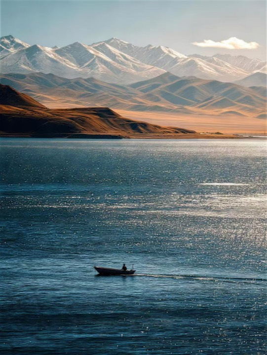
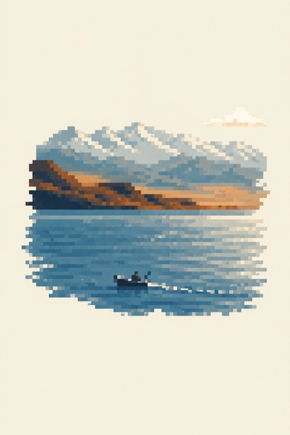

# 8-bit Pixel Art

[← Back to the English directory](../README_EN.md) · [Source repository](https://github.com/TwentyfiveBTea/8bit-pixel-art) · [Author](https://github.com/TwentyfiveBTea)

8-bit Pixel Art can create an original pixel editorial from a text brief or reinterpret an uploaded photograph. In photo mode it keeps the dominant relationship, large masses, direction, and color roles, then rebuilds them with coarse pixel blocks and deliberate negative space instead of applying a uniform pixelation filter.

## Preview

| Source photograph | Pixel editorial result |
| :---: | :---: |
|  |  |

## Modes

- `create` produces a new image from an ordinary-language art direction.
- `fuse` reinterprets an uploaded image while preserving the relationship that makes it recognizable.
- The default format is a portrait 3:5 composition, adapted when the user requests another ratio.

## Installation

```bash
mkdir -p ~/.codex/skills
git clone https://github.com/TwentyfiveBTea/8bit-pixel-art.git \
  ~/.codex/skills/8bit-pixel-art
```

Restart Codex if the Skill does not appear immediately.

## Example request

```text
Use $8bit-pixel-art to fuse this photo into a sparse 8-bit pixel editorial.
Keep the boat, long ridgeline, warm shore, and water direction recognizable.
```

## Safety and privacy

- Confirm that you may transform and publish the source photograph.
- Review the selected image model's privacy and retention settings before uploading sensitive material.
- Inspect requested lettering after generation; use a layout tool for long, legal, or brand-critical copy.
- The repository contains documentation, metadata, examples, and the Skill file without required executable scripts, but review all instructions before installation.

## License and preview provenance

The repository is published under the [GNU Affero General Public License v3.0](https://github.com/TwentyfiveBTea/8bit-pixel-art/blob/main/LICENSE). If you modify or redistribute repository materials, review the AGPL obligations. Rights in generated output and source photos can raise separate questions depending on the provider and input.

Preview sources: [`01-lake-mountains-original.png`](https://github.com/TwentyfiveBTea/8bit-pixel-art/blob/main/examples/01-lake-mountains-original.png) and [`01-lake-mountains-pixel.png`](https://github.com/TwentyfiveBTea/8bit-pixel-art/blob/main/examples/01-lake-mountains-pixel.png). They were resized and re-encoded without compositional alteration.
