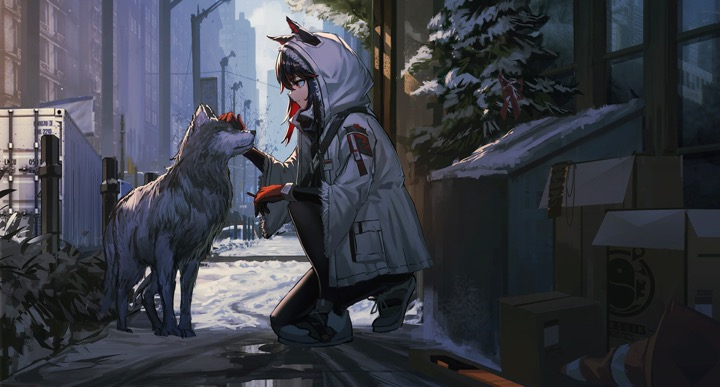

# GPT Image 2 Skill

[← Back to the English directory](../README_EN.md) · [Source repository](https://github.com/wuyoscar/GPT-Image2-Skill) · [Author](https://github.com/wuyoscar)

GPT Image 2 Skill combines a large prompt gallery with two installable Agent Skills: `get-prompt-from-image` analyzes a reference and returns a reusable prompt, while `gpt-image` generates or edits images through an available image tool or the included CLI.

## Preview

<p align="center"> <br><sub>Official reference · generated result</sub></p>

The repository credits the reference to contributor LunarXuan and identifies the second image as an ImageGen result produced from the extracted prompt.

## Best for

- turning an image's composition, medium, lighting, and mood into a reusable prompt;
- recreating or editing references with explicit preservation constraints;
- teams that want both an Agent Skill and a command-line image workflow.

## Installation

In Codex, use the built-in Skill installer with one or both source folders:

```text
$skill-installer
Install this skill from GitHub:
https://github.com/wuyoscar/GPT-Image2-Skill/tree/main/skills/get-prompt-from-image
```

```text
$skill-installer
Install this skill from GitHub:
https://github.com/wuyoscar/GPT-Image2-Skill/tree/main/skills/gpt-image
```

Restart Codex after installation. The optional CLI requires Python 3.11 or newer and may require `OPENAI_API_KEY`; Codex can instead use its platform-managed image tool when available.

## Example request

```text
Use $get-prompt-from-image to analyze this reference, write a reusable positive and negative prompt,
then use $gpt-image to create a new result while preserving the composition and mood.
```

## Safety and privacy

- Image API calls may incur cost and send references to a remote provider; check the selected model, account, retention settings, and estimated cost first.
- Keep API keys in environment variables or an approved secret store. Never paste them into prompts, Markdown, or committed files.
- Do not use reference images to impersonate people, reproduce protected characters or brands deceptively, or bypass the rights of the original creator.

## License and preview provenance

The repository is released under the [MIT License](https://github.com/wuyoscar/GPT-Image2-Skill/blob/main/LICENSE). The project asks downstream users to preserve the credits attached to gallery entries.

Preview sources: [`get-prompt-from-image-reference.jpg`](https://github.com/wuyoscar/GPT-Image2-Skill/blob/main/docs/illustration/get-prompt-from-image-reference.jpg) and [`get-prompt-from-image-result.png`](https://github.com/wuyoscar/GPT-Image2-Skill/blob/main/docs/illustration/get-prompt-from-image-result.png).
