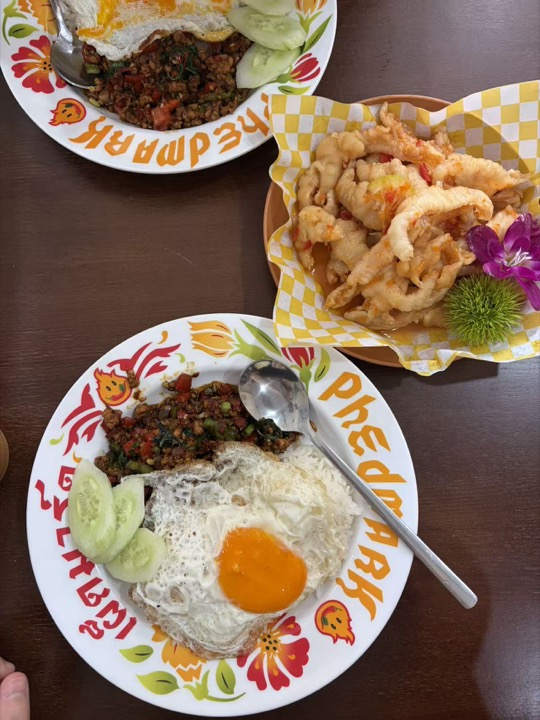
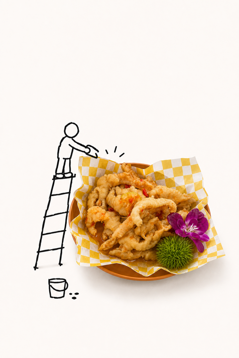

# Heytea Doodle Poster

[← Back to the English directory](../README_EN.md) · [Source repository](https://github.com/Hchen1218/heytea-style) · [Author](https://github.com/Hchen1218)

Heytea Doodle Poster turns a product, food, drink, or everyday photo into a playful editorial image that mixes a clean photographic cutout with sparse hand-drawn figures, energetic Chinese display type, and generous warm-white space. The repository also contains an optional desktop-pet workflow.

## Preview

<p align="center"> <br><sub>Official before · after</sub></p>

## Best for

- food, drinks, packaged products, and small objects with a clear hero subject;
- humorous social posters that combine photography and rough black-line doodles;
- users who want an optional path from a product image to an animated desktop character.

## Installation

```bash
git clone https://github.com/Hchen1218/heytea-style.git \
  ~/.codex/skills/heytea-doodle-poster
cd ~/.codex/skills/heytea-doodle-poster
python3 -m pip install -r requirements.txt
```

Reopen Codex after installation. Review the environment plan before installing the optional desktop-pet runtime.

## Example request

```text
Use $heytea-doodle-poster to turn this food photo into a playful vertical poster.
Keep the food recognizable, add only sparse black-line characters, and avoid logos or brand claims.
```

## Safety and privacy

- Installing Python dependencies and the optional pet runtime changes the local environment; inspect `requirements.txt` and the installation plan first.
- Do not add official logos, mascots, packaging marks, or endorsements unless you have permission.
- Remove receipt details, faces, locations, and other sensitive information before uploading a casual photo.

## License and preview provenance

Code and runtime components use the [MIT License](https://github.com/Hchen1218/heytea-style/blob/main/LICENSE). The repository states that its self-created examples are released under CC BY 4.0; see [`ASSET-NOTICE.md`](https://github.com/Hchen1218/heytea-style/blob/main/ASSET-NOTICE.md). Private reference cutouts are excluded from that grant and are not used here.

Preview sources: [`source-food.jpg`](https://github.com/Hchen1218/heytea-style/blob/main/assets/examples/poster/source-food.jpg) and [`doodle-poster.png`](https://github.com/Hchen1218/heytea-style/blob/main/assets/examples/poster/doodle-poster.png).
