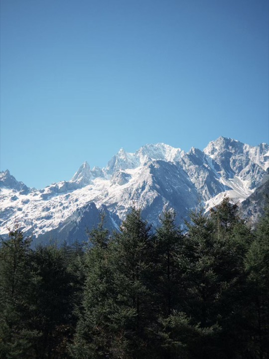
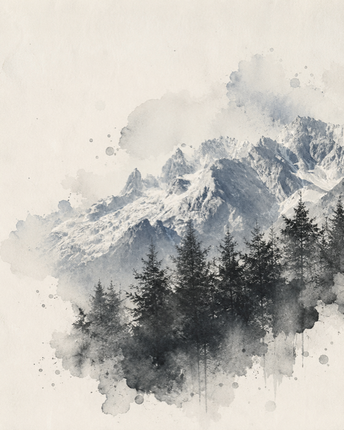

# Ink Wash Poster

[← Back to the English directory](../README_EN.md) · [Source repository](https://github.com/TwentyfiveBTea/ink-wash-poster) · [Author](https://github.com/TwentyfiveBTea)

Ink Wash Poster turns a theme, brief, or supplied reference image into a vertical ink-and-paper editorial poster. It builds the composition around one dominant ink gesture, controlled paper tone, sparse typography, and a clear visual hierarchy.

## Preview

<p align="center"> <br><sub>Official before · after</sub></p>

## Best for

- portraits, architecture, landscapes, and objects that benefit from expressive reduction;
- editorial covers with East Asian ink materiality and generous negative space;
- workflows that need the final prompt and recipe returned with the image.

## Installation

```bash
git clone https://github.com/TwentyfiveBTea/ink-wash-poster.git \
  ~/.codex/skills/ink-wash-poster
```

Restart Codex if the Skill does not appear immediately. Generation requires an available image tool.

## Example request

```text
Use $ink-wash-poster to reinterpret this photograph as a vertical ink-wash editorial poster.
Preserve the subject's identity and pose, use restrained typography, and return the final prompt.
```

## Safety and privacy

- Ask for consent before transforming identifiable people, especially when the result will be published.
- Inspect hands, faces, text, culturally specific symbols, and unintended stereotypes before use.
- A remote image model may receive the uploaded reference; do not submit confidential or sensitive material without an appropriate agreement.

## License and preview provenance

The repository is released under the [GNU AGPL v3](https://github.com/TwentyfiveBTea/ink-wash-poster/blob/main/LICENSE). Example-media rights can be narrower than the software license, so retain attribution and consult the project before commercial reuse.

Preview sources: [`03-reference-image-original.jpg`](https://github.com/TwentyfiveBTea/ink-wash-poster/blob/main/examples/03-reference-image-original.jpg) and [`03-reference-image-to-ink-wash.png`](https://github.com/TwentyfiveBTea/ink-wash-poster/blob/main/examples/03-reference-image-to-ink-wash.png).
