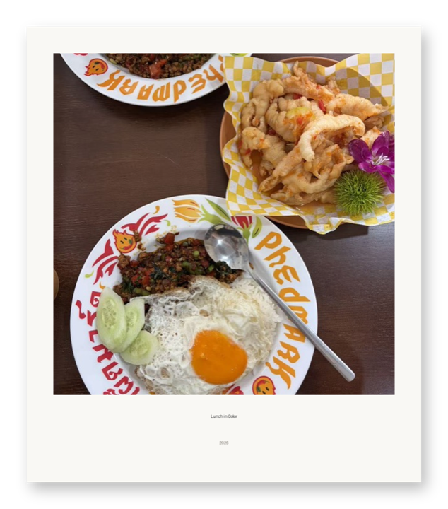

# Photo Polaroid

[← Back to the English directory](../README_EN.md) · [Source Skill](https://github.com/LeviQin/photo-agent-skills/tree/main/skills/photo-polaroid) · [Author](https://github.com/LeviQin)

Photo Polaroid places a photograph into a clean instant-photo keepsake with an optional caption, date, and rotation. Its deterministic local renderer preserves the source and writes a separate PNG.

## Preview

<p align="center"> <br><sub>Licensed source · locally rendered result</sub></p>

The result was created for this directory by running the repository's own `render_polaroid.py` helper on a CC BY 4.0 example photo from Hchen1218's Heytea Doodle Poster project.

## Best for

- quick memory cards and instant-photo framing;
- offline, deterministic output without generative reconstruction;
- captions and dates that must remain outside the photograph.

## Installation

```bash
git clone https://github.com/LeviQin/photo-agent-skills.git
cd photo-agent-skills
./install.sh --agents codex --scope user
```

The collection requires Python and the dependencies listed in `requirements.txt`; its installer validates destinations and backs up unmanaged name conflicts.

## Example request

```text
Use $photo-polaroid to make a clean Polaroid-style keepsake from this photo.
Caption it “Lunch in Color”, add the year, and keep the original file unchanged.
```

## Safety and privacy

- The bundled renderer works locally, but an agent may still use remote vision to interpret the photo; state that you want an offline-only workflow when necessary.
- Avoid inventing dates, places, or relationships from visual appearance.
- Use a new output path and verify that the source file was not overwritten.

## License and preview provenance

The collection is released under the [MIT License](https://github.com/LeviQin/photo-agent-skills/blob/main/LICENSE).

Source preview: Hchen1218's [`source-food.jpg`](https://github.com/Hchen1218/heytea-style/blob/main/assets/examples/poster/source-food.jpg), released by that repository under CC BY 4.0. Result preview: an adaptation created by this directory with LeviQin's MIT-licensed `render_polaroid.py` helper using caption `Lunch in Color` and date `2026`.
