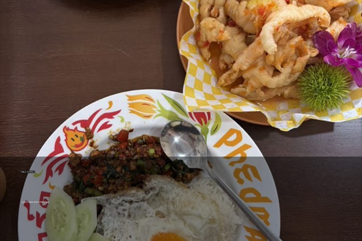

# Photo Postcard

[← Back to the English directory](../README_EN.md) · [Source Skill](https://github.com/LeviQin/photo-agent-skills/tree/main/skills/photo-postcard) · [Author](https://github.com/LeviQin)

Photo Postcard converts a photograph into a designed postcard front and can optionally render a printable message-and-address back. It favors short copy and avoids asserting a location unless the user supplied or verified it.

## Preview

<p align="center"> <br><sub>Licensed source · locally rendered result</sub></p>

The result was created for this directory with the repository's local `render_postcard.py` helper.

## Best for

- travel, place, and everyday-memory cards;
- deterministic front/back layouts with readable text;
- users who want a separate artifact without changing the source pixels.

## Installation

```bash
git clone https://github.com/LeviQin/photo-agent-skills.git
cd photo-agent-skills
./install.sh --agents codex --scope user
```

## Example request

```text
Use $photo-postcard to turn this image into a postcard front titled “Table Stories”.
Do not guess a location, and save the result as a new file.
```

## Safety and privacy

- Do not print private addresses or personal messages into a public preview.
- Verify any stated place, date, or event instead of inferring it from appearance.
- If a remote model is used to propose copy, review its data handling even though final rendering is local.

## License and preview provenance

The collection is released under the [MIT License](https://github.com/LeviQin/photo-agent-skills/blob/main/LICENSE).

Source preview: Hchen1218's [`source-food.jpg`](https://github.com/Hchen1218/heytea-style/blob/main/assets/examples/poster/source-food.jpg), released by that repository under CC BY 4.0. Result preview: an adaptation created by this directory with LeviQin's MIT-licensed `render_postcard.py` helper using `TABLE STORIES` and `Lunch, light, and a little chaos`.
