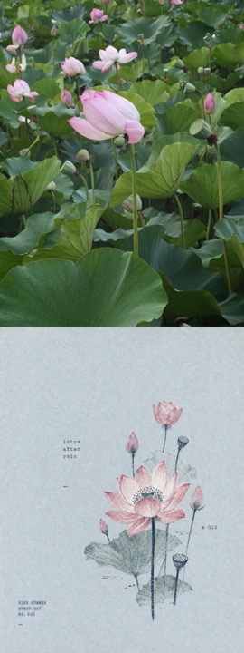

# Photo Riso Poster

[← Back to the English directory](../README_EN.md) · [Source repository](https://github.com/luckdvr/photo-riso-poster) · [Author](https://github.com/luckdvr)

Photo Riso Poster reads a photograph as evidence, reduces it to a small number of dominant forms and source-sampled color roles, and rebuilds it as a quiet risograph poster with grain, slight ink misregistration, and restrained type.

## Preview

<p align="center"><br><sub>Combined official before/after example</sub></p>

The comparison is kept intact: the source photograph is above and its transformed poster is below.

## Best for

- plants, food, landscapes, objects, and portraits with a readable silhouette;
- limited-ink posters with tactile print texture;
- choosing between more abstract and more faithful reinterpretation.

## Installation

```bash
git clone https://github.com/luckdvr/photo-riso-poster.git \
  ~/.codex/skills/photo-riso-poster
```

Start a new Codex task after installation. The Skill requires an available image-generation tool.

## Example request

```text
Use $photo-riso-poster to turn this photograph into a restrained risograph poster.
Keep the main silhouette recognizable and use only colors supported by the source.
```

## Safety and privacy

- The workflow may send the source photo to the host's image model; review the provider's data policy before using private images.
- Verify names, dates, counts, and other documentary text before publishing; image models can fabricate or misspell text.
- Use photographs and generated outputs that you are allowed to edit and redistribute.

## License and preview provenance

The project is released under the [MIT License](https://github.com/luckdvr/photo-riso-poster/blob/main/LICENSE). Its README states that the example photographs are the author's own and that generated posters follow the terms of the image tool that produced them.

Preview source: [`examples/comparisons/compare-1825.jpg`](https://github.com/luckdvr/photo-riso-poster/blob/main/examples/comparisons/compare-1825.jpg).
