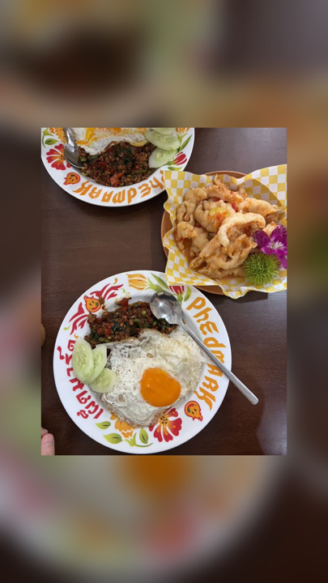

# Photo Wallpaper

[← Back to the English directory](../README_EN.md) · [Source Skill](https://github.com/LeviQin/photo-agent-skills/tree/main/skills/photo-wallpaper) · [Author](https://github.com/LeviQin)

Photo Wallpaper adapts a photograph to an exact phone or desktop canvas without non-uniform stretching. It can use a blurred cover background, a center crop, or a plain fitted background while preserving the source as a separate file.

## Preview

<p align="center"> <br><sub>Licensed source · locally rendered result</sub></p>

The result was created for this directory with the repository's local `make_wallpaper.py` helper in `blur` mode.

## Best for

- phone, lock-screen, tablet, and desktop wallpapers;
- converting landscape photos to portrait canvases without stretching;
- deterministic, offline pixel processing with exact output dimensions.

## Installation

```bash
git clone https://github.com/LeviQin/photo-agent-skills.git
cd photo-agent-skills
./install.sh --agents codex --scope user
```

## Example request

```text
Use $photo-wallpaper to make a 1440x3200 phone wallpaper from this photo.
Use blur mode, protect the subject from the clock area, and do not overwrite the source.
```

## Safety and privacy

- The renderer itself is local and deterministic; an agent may still call vision tools to inspect the composition unless told not to.
- Check faces and key objects against the lock-screen clock, widgets, and crop boundaries.
- Always write to a new output path and verify the exact dimensions before delivery.

## License and preview provenance

The collection is released under the [MIT License](https://github.com/LeviQin/photo-agent-skills/blob/main/LICENSE).

Source preview: Hchen1218's [`source-food.jpg`](https://github.com/Hchen1218/heytea-style/blob/main/assets/examples/poster/source-food.jpg), released by that repository under CC BY 4.0. Result preview: an adaptation created by this directory with LeviQin's MIT-licensed `make_wallpaper.py` helper at `720x1280` in `blur` mode.
