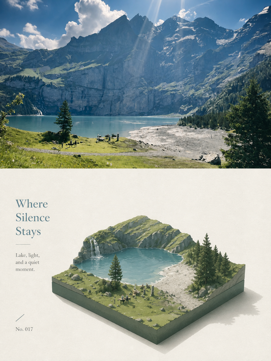

# XXD Panel 028

[← Back to the English directory](../README_EN.md) · [Source repository](https://github.com/nevertoday/xxd-panel-028) · [Author](https://github.com/nevertoday)

XXD Panel 028 translates a photograph's recognizable mass, silhouette, relationships, and source colors into an orthographic isometric paper miniature. It supports paired layouts, design-only outputs, wallpaper packs, multiple sizes, and batch input.

## Preview

<p align="center"><br><sub>Combined official before/after example</sub></p>

The official top-bottom sample keeps the source photograph visible and places the source-derived miniature below it.

## Best for

- architecture, landscape, travel, and object photos with strong shape and color cues;
- isometric editorial miniatures rather than generic toy-city renders;
- producing paired comparisons, design-only assets, or device wallpapers from one source.

## Installation

```bash
git clone https://github.com/nevertoday/xxd-panel-028.git
mkdir -p ~/.codex/skills
ln -s "$(pwd)/xxd-panel-028" ~/.codex/skills/xxd-panel-028
```

The default route expects an available image model. Review the repository's configured-image route and scripts before using third-party credentials.

## Example request

```text
Use $xxd-panel-028 on this photo. Recommend the best layout and size first,
then create a top-bottom result with source-derived colors and no invented landmarks.
```

## Safety and privacy

- Batch mode can discover many images recursively; verify the input directory before running it.
- The Skill says preferences do not store source images or credentials, but the chosen model may still receive the images remotely.
- Never expose API keys in prompts or logs, and review generated location text before treating it as fact.

## License and preview provenance

The project—including its accompanying samples—is released under the [PolyForm Noncommercial License 1.0.0](https://github.com/nevertoday/xxd-panel-028/blob/main/LICENSE). Commercial use requires separate permission, and shared copies must retain the license and required notices.

Preview source: [`assets/examples/sample-09.png`](https://github.com/nevertoday/xxd-panel-028/blob/main/assets/examples/sample-09.png).
